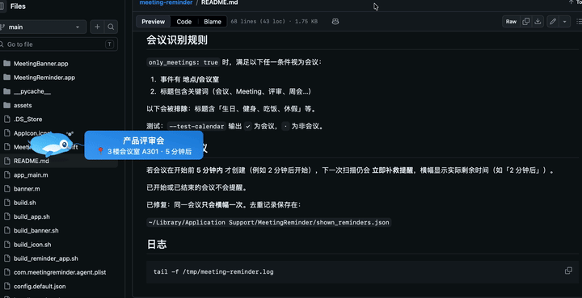

# Meeting Reminder for macOS

会议开始前，卡通海豚拖着横幅游过屏幕。

## 自行生成并安装

```bash
git clone xxx
cd meeting-reminder
./setup.sh
open MeetingReminder.app
```
或者直接release中下载即可。

## 功能

- **程序坞 + 菜单栏** 双入口，菜单栏显示海豚图标
- **默认每 60 秒**扫描一次日历
- **每个会议只提醒一次**（持久化去重）
- **只提醒会议类事件**，过滤个人日程（生日、健身等）
- **偏好设置**可配置扫描间隔、横幅速度等

## 偏好设置

菜单栏 🐬 → **偏好设置...**（或 `⌘,`）

原生设置窗口，可配置：

- 提前提醒分钟数
- 扫描间隔
- 横幅飘过速度
- 仅提醒会议 / 必须有会议室
- 包含/排除关键词
- 指定日历

点击 **保存并生效** 后立即应用，无需手动编辑 JSON。

配置文件仍保存在（供高级用户）：

`~/Library/Application Support/MeetingReminder/config.json`

## 会议识别规则

`only_meetings: true` 时，满足以下**任一**条件视为会议：

1. 事件有 **地点/会议室**
2. 标题包含关键词（会议、Meeting、评审、周会…）

以下会被**排除**：标题含「生日、健身、吃饭、休假」等。

测试：`--test-calendar` 输出 `✓` 为会议，`·` 为非会议。

## 临期新增会议

若会议在开始前 **5 分钟内** 才创建（例如 2 分钟后开始），下一次扫描仍会 **立即补救提醒**，横幅显示实际剩余时间（如「2 分钟后」）。

已开始或已结束的会议不会提醒。


已修复：同一会议**只会横幅一次**。去重记录保存在：

`~/Library/Application Support/MeetingReminder/shown_reminders.json`

## 日志

```bash
tail -f /tmp/meeting-reminder.log
```
